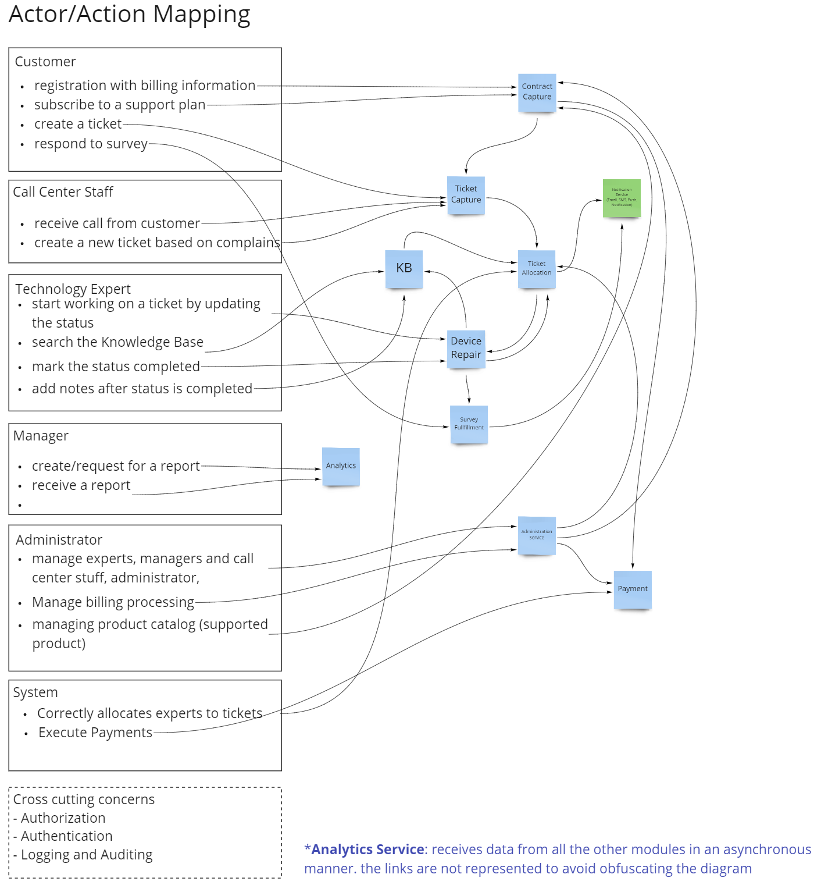

# architectural-katas

  

## Introduction

## Architecture Characteristics

We have analysed the slides and the video in order to extract the main challenges faced by sysops with the existing system.
Once we identified the main issues (represented below by the pink stickers) we verified which Architecture Characteristics are most relevant to address the identified issues. As a reference for the list of architecture characteristics we utilized the book Mark Richards and Neal Ford "Fundamentals of Software Architecture". The architecture characteristics are represented by the yellow stickers below.

  

## Architecture Style

## Actor/Action

  

## Event Storm

  

## Architectural Topology

  

## Data Model

  

