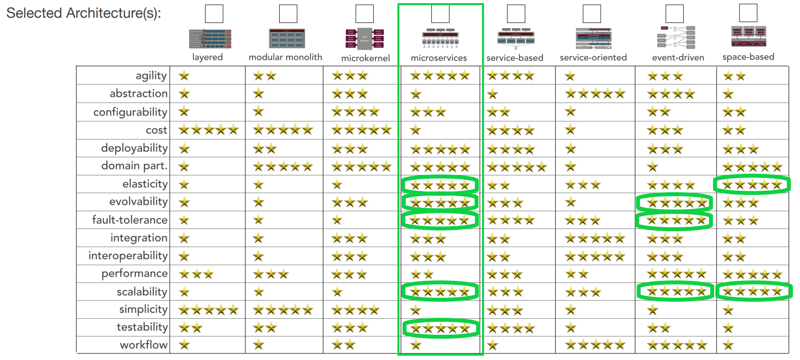

# Architectural-Katas-Team-3

  

## Introduction

The given Sysops Squad system has many drawbacks that include customer and call center stuff complains about losing track of the created tickets, wrong consultant shows up to fix the customer's problem, system freezes or crashes during a spike and changes in the system is very difficult due to its monolith archtecture. These drawbacks are due to not having proper architectural dicision and design. In order to resolve those problems we have considers following set of actions:
* Understanding the problems and identified the architectural characterstics for solving the problems
* Defined the new architeture style by Actor/Action and Event Storm approaches. 
* Define some ADRs

## Architecture Characteristics

We have analysed the slides and the video in order to extract the main challenges faced by sysops with the existing system.
Once we identified the main issues (represented below by the pink stickers) we verified which Architecture Characteristics (Scalabilty, Elasticity, Fault-tolerence, Testability and Evolbalility) are most relevant to address the identified issues. As a reference for the list of architecture characteristics we utilized the book [Mark Richards and Neal Ford, Fundamentals of Software Architecture](https://learning.oreilly.com/library/view/fundamentals-of-software/9781492043447/). The architecture characteristics are represented by the yellow stickers below.

  

## Architecture Style
There are different types of architecurual style exist (Layered, Modular-Monolith, Microkernel, Microservice and so on) and those are also mentioned in the book [Mark Richards and Neal Ford, Fundamentals of Software Architecture](https://learning.oreilly.com/library/view/fundamentals-of-software/9781492043447/). We have analised the pros and cons between the two style that include modular-monolith and microservice architecture. Finally we have decided to use microservic architecutural sytle in order to solve the current system architecutre.

  

## Actor/Action
Here, we have identified the actors and actions from the exiting architecture and given functinalites of the system.

  

## Event Storm
The Actor/Action method allowed us to have a first view of the services and the interaction among them.
Moreover, we have utilized the event storm to build understanding and confidence on the solution approach we are proposing. As the diagram below shows, we could visualize the functions that would be implemented by each service and also the way the services would interact in the future platform.

  

## Architectural Topology

  

| Component        | Description|
| ------------- |-------------|
| Contract Capture Service      | Responsible for customer onboarding to the platform and manage Customer Contracts. Client face critical service. |
| Ticket Capture Service      | Responsible for ticket creation and ticket updates. Shared between Clients and Support Staff. Client face critical service.      |
| Ticket Allocation Service      | Contains the business logic to match Technology Experts and tickets. Highly specialized service that can evolve independently from the other microservices to include fuzzy logic, account for route optimization and optimization of technology experts working time. Can also have elements of AI and integration with Knowledge Base in the future. It also integrates the third party applications such as googlemaps to get geolocation information of experts and customers in realtime, internets providers to send sms or push notification to the exterts about a new ticket and custommers about the status of the ticket. We have coupled the notification service into this service based on the [ARD0005](adrs/adr0005-third-party-integration-layer.mdr-staff-modularization.md)      |
| Device Repair Service      | Supports the technical expert on the closure of a ticket. We decided to keep it separated from the Ticket Capture Services. For the rational on the decision, please refer to [ADR0003](adrs/adr0003-modularization-ticket_processing.md).      |
| Survey Fulfillment Service      | Responsible for supporting the customer on the fulfillment of the survey. Once the Device Repair service completes a tickets this service will be triggered and customers get notified through internet providers. The reason of coupling notification service is here: [ARD0005](adrs/adr0005-third-party-integration-layer.mdr-staff-modularization.md)      |
| Knowledge Base Service      | Responsible for the providing the information about previous resolutions as well as documentation of supported products.       |
| Administrator Service      | Supports all administrative tasks such as new product creation, employee/staff maintenance.      |
| Analytics Service      |  Responsible to provide realtime reports on the overal performance of the company. Provides multiple metrics and KPIs for Business Inteligence. Receives realtime data from all the other services, compiling and aggregating the information for Management decisions.      |
| Logging and Aggregration service     | Compiles log information from all platform to support the Site Reliability Engineer on monitoring and troubleshooting technical issues with the platform.      |
| Payment service     | Responsible for executing the payments of the customers and managing accountings.      |

## Data Model
The datamodel from the current monolith datamodel is complex and has many interdependencies on the tables. 

  

We have analysed the Sysops monolith datamodel and here we propose the segregation of data according to the functional decomposition of the microservices. All data is shared via well defined APIs and there is NO database sharing among the microservices. It is to be noted that, in order to remove the dependencies among microservices, so entities are duplicated (example: Supported Product). This is intentional and by design.

  

