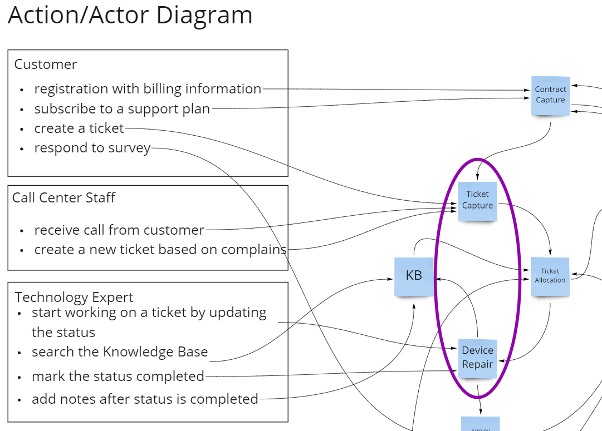

# Modularization of Ticket Processing
creation: 28.Apr.2021

## Status (proposed, accepted, rejected, deprecated, superseded)
tbd

## Context
There are two possibilites to model the processing of tickets in the system.  
- Two modules approach:  
  - Module "Ticket Capture" - having the responsibility to capture a client's ticket.  
  - Module "Ticket Fullfillment" - having the responsibility to fullfill the ticket (used mostly by the Expert during the repair process).  

  

- One module approach:  
  - Ticket Handler aggregating the 2 modules above into a single module.

  

The "Two modules approach" enforces better segregation of duty and alows for higher maintainability.  
The "One Module approach" reduces system complexity.  

## Decision

tbd

## Consequences

What becomes easier or more difficult to do because of this change?
