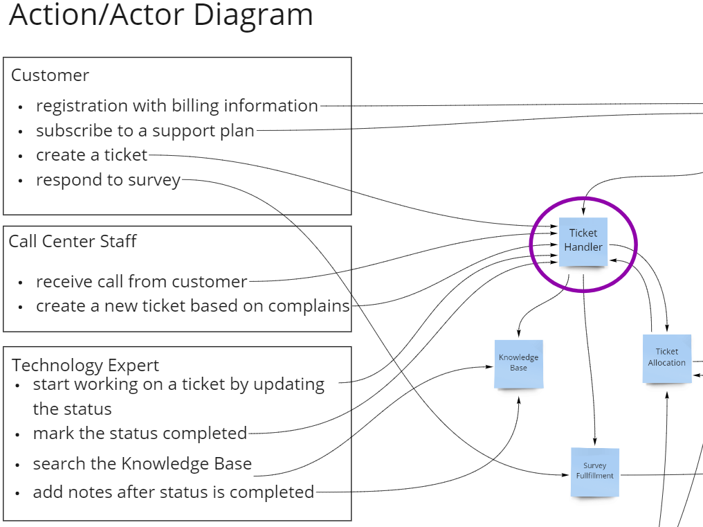

# ARD0003 - Modularization of Ticket Processing
Creation: 28.Apr.2021

## Status (proposed, accepted, rejected, deprecated, superseded)
accepted

## Context
There are two possibilites to model the processing of tickets in the system.  
- Two modules approach:  
  - Module "Ticket Capture" - having the responsibility to capture a client's ticket.  
  - Module "Device Repair" - having the responsibility to fullfill the ticket (used mostly by the Expert during the repair process).  

  

- One module approach:

  - Ticket Handler aggregating the 2 modules above into a single module.

  

"Two modules approach":
 pros:  
 - allows for higher maintainability and fault-tolerance (if "Ticket Capture" is down, "Device Repair" can still be done).  
 - split of producer and consumer resonsibilities  
 - independent scalability between producer and consumer  
 cons:  
 - increase in complexity
 - eventual consistency between producer and consumer

The "One Module approach"   
pros:  
  - reduces system complexity  
  - always consistent (no distributed data) 
  - less costly  
cons:
  - coupling between consumer and producer
  - reduction on fault-tolerance (either all the handling - consumer and producer - is down or all is up)    

## Decision

The "Two modules approach". We prioritize customer satisfaction over cost and complexity. If the "Device Repair" is under maintenance, the "Ticket Capture" can still operate.  

## Consequences

  Revisit costs/estimates and reasure budget considering solution is more costly.  
  Creation of 2 microservices ("Ticket Capture" and "Device Repair")  
